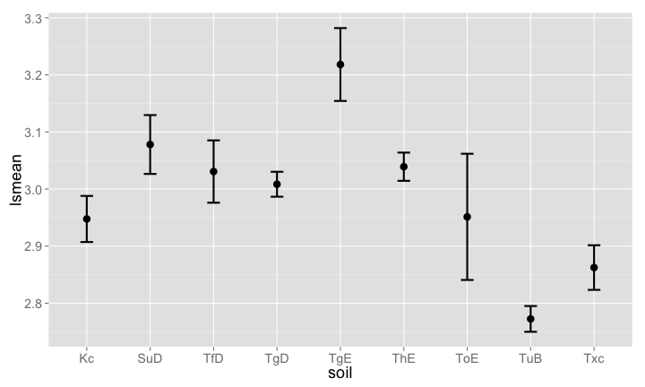

## Load packages


```r
library('car')
library('lsmeans')
library('plyr')
library('dplyr')
library('ggplot2')
library('knitr')
library('scales')
```

## Define some helper functions


```r
get_means <- function(x){
  list(means = as.data.frame(summary(x[[1]])), 
       diffs = as.data.frame(summary(x[[2]]))
  )
}

gg <- function(){
  list(
    geom_point(size = 4),
    geom_errorbar(limits, size = 1, width=0.2),
    theme_grey(base_size = 18)
  )
}

limits <- aes(ymax = lsmean + SE, ymin = lsmean - SE)

# Define function to get quick summary by factor variable
avg_by <- function(...){
  dat_df %>% 
    group_by(...) %>%
    summarise(rdm_mean = mean(rdm, na.rm = TRUE),
              rdm_sd = sd(rdm, na.rm = TRUE),
              rdm_n = length(na.omit(rdm))) %>%
    kable(format = "markdown")
}
```

## Summary of data

Prep data


```r
dat <- read.csv("dittes_data2.csv", stringsAsFactors = FALSE)
dat$date <- as.Date(paste(as.character(dat$year), "-01-01", sep = ""), "%Y-%m-%d")
dat <- dat[ !dat$habitat == 2, ] # drop habitat=32
dat$rdm <- dat$rdm*100 # multiply rdm by 100
dat$landform <- tolower(dat$landform)
```

Make a `dplyr` `tbl_df` object


```r
dat_df <- tbl_df(dat)
```

by transect


```r
avg_by(transect)
```


|transect | rdm_mean| rdm_sd| rdm_n|
|:--------|--------:|------:|-----:|
|AD10     |   1346.4| 1142.5|    84|
|AD11     |   1847.6| 1803.2|    85|
|AD12     |   1789.4| 1287.7|    85|
|AL1      |    941.9|  707.2|    80|
|BK5      |    840.0|  688.7|    70|
|BL7      |   1677.6| 1663.6|    85|
|ML9      |   1567.6| 1913.6|    85|
|NF6      |   1146.7|  802.3|    75|
|NV8      |   1246.1| 1159.9|    85|
|PK2      |   1069.3|  677.5|    75|
|PL3      |    725.5|  686.4|    85|
|PL4      |    751.8|  503.1|    85|

by year


```r
avg_by(year)
```


| year| rdm_mean| rdm_sd| rdm_n|
|----:|--------:|------:|-----:|
| 1997|   1721.7| 2574.7|    60|
| 1998|   1887.5| 1839.5|    60|
| 1999|   2024.0| 1920.7|    50|
| 2000|   1267.6| 1033.7|   110|
| 2001|   1521.7|  947.3|   120|
| 2002|   1055.8|  769.4|   120|
| 2003|    727.7|  407.7|   110|
| 2004|    887.1|  532.1|   120|
| 2005|   1711.8| 1326.1|   110|
| 2014|    745.0|  625.3|   119|

by soil type


```r
avg_by(soil)
```


|soil | rdm_mean| rdm_sd| rdm_n|
|:----|--------:|------:|-----:|
|Kc   |   1069.3|  677.5|    75|
|SuD  |   1683.7| 1317.0|    46|
|TfD  |   1325.6|  967.8|    41|
|TgD  |   1472.5| 1646.9|   257|
|TgE  |   2160.0| 1499.4|    30|
|ThE  |   1526.8| 1351.1|   200|
|ToE  |    965.0|  386.6|    10|
|TuB  |    768.2|  627.5|   240|
|Txc  |    941.9|  707.2|    80|

by slope_class


```r
avg_by(slope_class)
```


| slope_class| rdm_mean| rdm_sd| rdm_n|
|-----------:|--------:|------:|-----:|
|           1|   1134.1| 1281.9|   523|
|           2|   1275.2| 1055.5|   204|
|           3|   1529.6| 1324.0|   240|
|           4|    795.8|  628.3|    12|

by landform


```r
avg_by(landform)
```


|landform  | rdm_mean| rdm_sd| rdm_n|
|:---------|--------:|------:|-----:|
|foothills |   1524.0| 1469.2|   584|
|terraces  |    860.6|  663.4|   395|

by habitat


```r
avg_by(habitat)
```


|habitat   | rdm_mean| rdm_sd| rdm_n|
|:---------|--------:|------:|-----:|
|grassland |     1156|   1123|   700|
|woodland  |     1508|   1505|   279|

All combinations of variables


```r
avg_by(transect, year, soil, slope_class, landform, habitat) %>% data.frame
```


## Data analysis

All analyses are done with `rdm` (residual dry matter in lbs/sq acre) as the response variable. Plots use least square means for the y-variables since these take into account the statistical model that was used, wehreas raw data, although more meaningful, may be misleading. Confidence intervals on plots are 95% CI's.

### Prepare data a bit


```r
dat <- dat_df %>% filter(!is.na(rdm), !rdm < 2) %>% mutate(soil = as.factor(soil)) 
```

### Does RDM differ between soil types?


```r
mod <- dat %>% lm(log10(rdm + 1) ~ soil, data=.) 
# mod %>% plot
mns <- mod %>% lsmeans(list(pairwise ~ soil), adjust = c("tukey")) %>% get_means
mod %>% Anova(type = "3") %>% kable(format = "markdown")
```


|            | Sum Sq|  Df| F value| Pr(>F)|
|:-----------|------:|---:|-------:|------:|
|(Intercept) | 651.61|   1| 5331.46|      0|
|soil        |  13.81|   8|   14.13|      0|
|Residuals   | 118.43| 969|      NA|     NA|

Plot by soil type


```r
mns$means %>% ggplot(aes(soil, lsmean)) + gg()
```

 

### Does RDM differ among years within each transect? 


```r
mods <- dat %>% mutate(year = as.factor(year)) %>% group_by(transect) %>% do(model = lm(log10(rdm + 1) ~ year, data=.))
# mods$model[[1]] %>% plot
mns_s <- lapply(mods$model, function(x) x %>% lsmeans(list(pairwise ~ year), adjust = c("tukey")) %>% get_means)
for(i in seq_along(mods$model)){
  cat("\n")
  cat(sprintf("__%s__\n", mods$transect[i]))
  mods$model[[i]] %>% Anova(type = "3") %>% kable(format = "markdown")
}
```


__AD10__


|            | Sum Sq| Df| F value| Pr(>F)|
|:-----------|------:|--:|-------:|------:|
|(Intercept) | 45.617|  1| 329.698| 0.0000|
|year        |  3.037|  9|   2.439| 0.0173|
|Residuals   | 10.239| 74|      NA|     NA|

__AD11__


|            | Sum Sq| Df| F value| Pr(>F)|
|:-----------|------:|--:|-------:|------:|
|(Intercept) | 60.764|  1|  993.08|      0|
|year        |  7.633|  9|   13.86|      0|
|Residuals   |  4.528| 74|      NA|     NA|

__AD12__


|            | Sum Sq| Df| F value| Pr(>F)|
|:-----------|------:|--:|-------:|------:|
|(Intercept) | 54.329|  1|  603.86| 0.0000|
|year        |  2.453|  9|    3.03| 0.0039|
|Residuals   |  6.748| 75|      NA|     NA|

__AL1__


|            | Sum Sq| Df| F value| Pr(>F)|
|:-----------|------:|--:|-------:|------:|
|(Intercept) | 36.862|  1| 482.820|  0e+00|
|year        |  2.983|  8|   4.885|  1e-04|
|Residuals   |  5.421| 71|      NA|     NA|

__BK5__


|            | Sum Sq| Df| F value| Pr(>F)|
|:-----------|------:|--:|-------:|------:|
|(Intercept) | 34.209|  1| 382.069|      0|
|year        |  4.491|  7|   7.165|      0|
|Residuals   |  5.551| 62|      NA|     NA|

__BL7__


|            | Sum Sq| Df| F value| Pr(>F)|
|:-----------|------:|--:|-------:|------:|
|(Intercept) | 44.255|  1| 424.949| 0.0000|
|year        |  2.921|  9|   3.116| 0.0031|
|Residuals   |  7.811| 75|      NA|     NA|

__ML9__


|            | Sum Sq| Df| F value| Pr(>F)|
|:-----------|------:|--:|-------:|------:|
|(Intercept) | 58.661|  1|  772.27|  0e+00|
|year        |  3.247|  9|    4.75|  1e-04|
|Residuals   |  5.697| 75|      NA|     NA|

__NF6__


|            | Sum Sq| Df| F value| Pr(>F)|
|:-----------|------:|--:|-------:|------:|
|(Intercept) | 43.382|  1|  548.19|  0e+00|
|year        |  2.735|  8|    4.32|  3e-04|
|Residuals   |  5.223| 66|      NA|     NA|

__NV8__


|            | Sum Sq| Df| F value| Pr(>F)|
|:-----------|------:|--:|-------:|------:|
|(Intercept) | 32.461|  1| 197.346| 0.0000|
|year        |  2.758|  9|   1.863| 0.0707|
|Residuals   | 12.337| 75|      NA|     NA|

__PK2__


|            | Sum Sq| Df| F value| Pr(>F)|
|:-----------|------:|--:|-------:|------:|
|(Intercept) | 39.061|  1| 819.681|      0|
|year        |  2.405|  8|   6.307|      0|
|Residuals   |  3.145| 66|      NA|     NA|

__PL3__


|            | Sum Sq| Df| F value| Pr(>F)|
|:-----------|------:|--:|-------:|------:|
|(Intercept) | 32.955|  1| 500.171|      0|
|year        |  3.290|  9|   5.548|      0|
|Residuals   |  4.942| 75|      NA|     NA|

__PL4__


|            | Sum Sq| Df| F value| Pr(>F)|
|:-----------|------:|--:|-------:|------:|
|(Intercept) | 32.328|  1| 494.225| 0.0000|
|year        |  1.676|  9|   2.847| 0.0061|
|Residuals   |  4.906| 75|      NA|     NA|

Plot for each transect, among years


```r
rbind_all(Map(function(x,y) data.frame(transect=y, x), lapply(mns_s, "[[", "means"), unique(dat_df$transect))) %>%
  mutate(date = as.Date(paste0(year,"-01-01"), "%Y-%m-%d")) %>%
  ggplot(aes(date, lsmean)) + gg() + facet_wrap(~ transect) + scale_x_date(labels = date_format("%Y"))
```

 

### Power analysis (to figure out appropriate sample size)

> NOT DONE YET...
